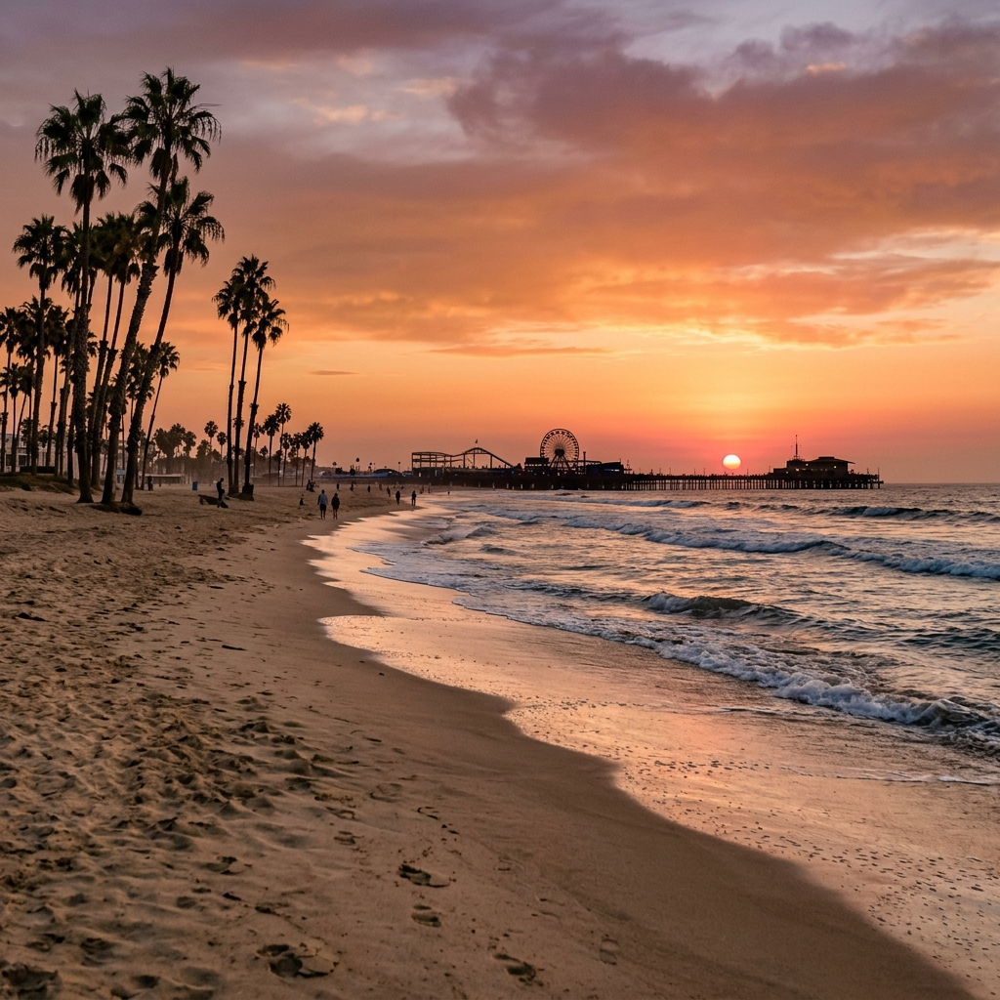

# 聖塔莫尼卡的夏日

落日長巷捲起風景
煙捲厭倦燃燒
在有海的地方
最後一個聖塔莫尼卡的夏日
啤酒開始變熱

不願再去尋找誰的長睫毛
或裙擺 白淨腳踝
踏進來時
夜晚都亮了起來
永遠的無事可做

無聊如金屬溫度
擁抱著也只是冰冷
失溫的高跟鞋大聲訴說秘密
燈光愈黑笑的愈燦爛

像所有的儀式一般
有開始就有結束
大西洋岸邊的海豹數著北極熊的毛
數完道別最後的晚上
還能像一個詩人般被溫柔的記住

